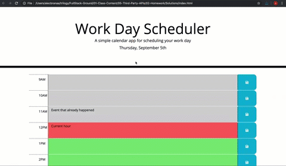

# Work Day Scheduler

## Purpose
A daily schedule planner that an user can manage their time effectively

## Criteria

The current day is shown at the top of the page. The day is broke down into hour long blocks for standard business hours. The time blocks are color coded for past, present, and future. The user can click in the blocks and add text then save it with the save button. The text persists on refresh of the page.

## Built with 
* HTML
* CSS
* JavaScript
* jQuery API
* BootStrap API
* Moment.js API

## Website
https://jleitz27.github.io/work-day-scheduler/ 

##

  

## Contribution
Made by Jason Leitz